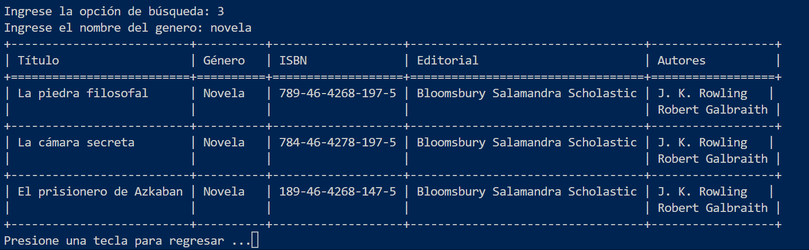
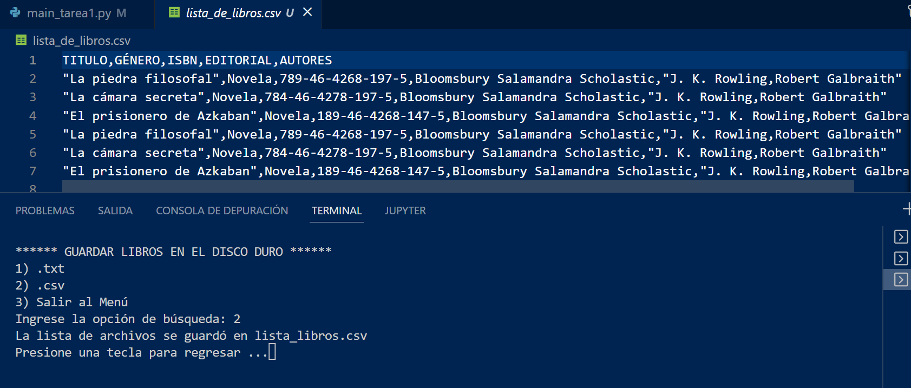
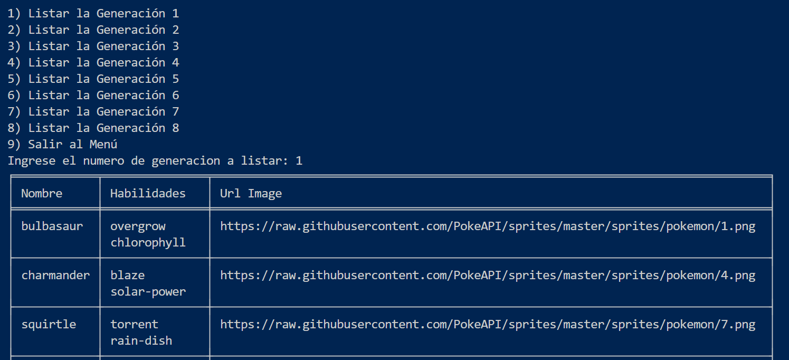

# TRABAJO FIN DE UNIDAD

**ÍNDICE**

**Table of Contents**

1. [Módulos a instalar](#módulos-a-instalar)  
2. [Tarea 1: BIBLIOTECA](#tarea1-biblioteca)  
    - [Leer archivo de disco duro (.txt o csv)](#opción-1-leer-archivo-de-disco-duro)  
    - [Listar libros](#opción-2-listar-libros)  
    - [Agregar libro](#opción-3-agregar-libro)  
    - [Eliminar libro](#opción-4-eliminar-libro)  
    - [Buscar libro por ISBN o por título](#opción-5-buscar-libro-por-isbn-o-por-título)  
    - [Ordenar libros por título](#opción-6-ordenar-libros-por-título)
    - [Buscar libros por autor, editorial o género](#opción-7-buscar-libros-por-autor-editorial-o-género)
    - [Buscar libros por número de autores](#opción-8-buscar-libros-por-número-de-autores)
    - [Editar o actualizar datos de un libro](#opción-9-editar-o-actualizar-datos-de-un-libro)
    - [Guardar libros en archivo de disco duro (.txt o csv)](#opción-10-guardar-libros-en-archivo-de-disco-duro)
3. [Tarea 2: POKEPEDIA](#tarea2-biblioteca)  
    - [Listar pokemons por generación](#opción-1-listar-pokemons-por-generación)    
    - [Listar pokemons por forma](#opción-2-listar-pokemons-por-forma)    
    - [Listar pokemons por habilidad](#opción-3-listar-pokemons-por-habilidad)    
    - [Listar pokemons por habitat](#opción-4-listar-pokemons-por-habitat)       
    - [Listar pokemons por tipo](#opción-5-listar-pokemons-por-tipo) 
4. [Autores](#autores)
***
## Módulos a instalar
***
Crear un entorno virtual:

```sh
$ python virtualenv venv
# windows
$ source venv/Scripts/activate
# Linux
$ source venv/bin/activate
```

Luego instala las librerias:

```sh
(venv)$ pip install -r requirements.txt
```
***
## Tarea1: BIBLIOTECA
***
### Opción 1: Leer archivo de disco duro
Consideraciones:
-El archivo a leer es .txt o .csv


### Opción 2: Listar libros
Esta opción permite ver todos los libros guardados

### Opción 3: Agregar libro
Consideraciones: 
- Se ha validado el ISBN
- El número de autores debe ser mayor a 0

### Opción 4: Eliminar libro
Consideraciones: 
- Se utiliza el código ISBN para identificar el libro a eliminar.

### Opción 5: Buscar libro por ISBN o por título
Caso ISBN:

Caso título:

### Opción 6: Ordenar libros por título

### Opción 7: Buscar libros por autor editorial o género
Consideraciones: 
- Se busca libros por nombre o nombre completo de autor, editorial o genero que se ingrese.




### Opción 8: Buscar libros por número de autores

### Opción 9: Editar o actualizar datos de un libro
Consideraciones: 
- Se va a editar el libro según el ISBN ingresado
- Se brindan 2 opciones de edición <br>

- En editar autores de la 2 opción, se brinda le da las alternativas de agregar un nuevo autor, eliminar o modificar

### Opción 10: Guardar libros en archivo de disco duro
Consideraciones: 
- Se puede elegir guardar los libros en un archivo .txt o .csv.


***
## Tarea2: POKEAPI
***
<br>-Se muestra un menú para elegir si se quiere listar por generaciones, forma, habilidad, habitat y tipo.<br>

<br>NOTA:<br>
<br>En cualquier opcion se imprimen los 10 primeros pokemones y despues se consulta si desea continuar buscando más pokemones.<br>


### Opción 1: Listar pokemons por generación
<br>-Primero se muestra un menú con las 8 generaciones a elegir.<br>
<br>
-Al ingresar el número de la generacion se imprime el nombre , las habilidades y el URL de la imganen del pokemon<br>


### Opción 2: Listar pokemons por forma
<br>-Primero se muestra el menú para listar por forma<br>

<br>Si se escoge la primera opcion se puede escribir directamente la forma a listar.<br>

<br>Si se escoge la segunda te muestra las 14 formas que existen y despues ya puedes escirbir la forma que quieras.<br>

### Opción 3: Listar pokemons por habilidad
<br> Opciones del menú de habilidades:
-Se puede ingresar una habilidad <br>

<br>
-Se puede listar e ingresar la opcion a buscar (Ademas de ello está paginado para VER MAS o REGRESAR A LAS YA VISTAS) <br>

<br>
-Listado <br>

### Opción 4: Listar pokemons por habitat

### Opción 5: Listar pokemons por tipo


***
## Autores
***

✅Gefferson Casasola
✅Jaqueline Ramos
✅Raisa Orellana

